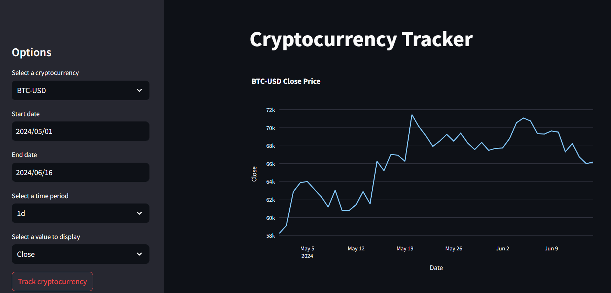
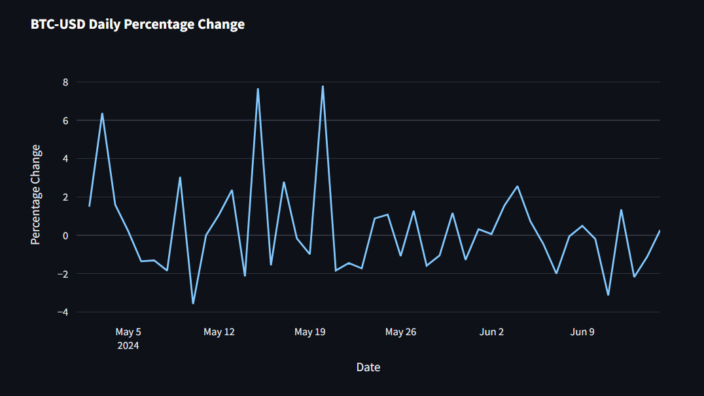
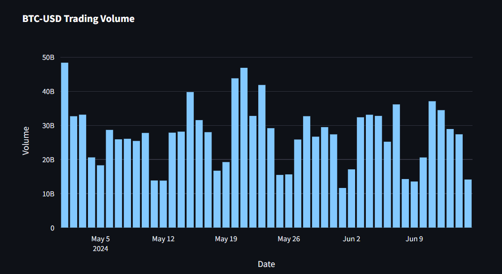

# CRYPTO_CURRENCY_TRACKER

## Overview
The **CRYPTO_CURRENCY_TRACKER** is a web application built with Python and Streamlit that allows users to track real-time data of their favorite cryptocurrencies from Yahoo Finance. It provides interactive features for selecting cryptocurrencies, date ranges, and displaying essential metrics such as price trends, trading volume, and daily percentage changes using dynamic Plotly charts.

## Features
- Select from a variety of cryptocurrencies available on Yahoo Finance.
- Choose custom date ranges to view historical data.
- Display real-time price trends, trading volume, and daily percentage changes.
- Interactive Plotly charts for enhanced data visualization.

## Installation
To run the **CRYPTO_CURRENCY_TRACKER** locally, follow these steps:
1. Clone the repository:
   ```
   git clone https://github.com/spidey0101/CRYPTO_CURRENCY_TRACKER.git
   ```
2. Navigate into the project directory:
   ```
   cd CRYPTO_CURRENCY_TRACKER
   ```

## Usage
To launch the application, run:
```
streamlit run main.py
```
This will open a new tab in your default web browser with the **CRYPTO_CURRENCY_TRACKER** interface.

## Technologies Used
- Python
- Streamlit
- Plotly
- Pandas
- Yahoo Finance API

## Screenshots
<p float="left">
  
   
  
</p>


## Contributing
Contributions are welcome! If you have any suggestions or feature requests, please open an issue or submit a pull request.

## License
This project is licensed under the MIT License - see the LICENSE file for details.

## Acknowledgments
Special thanks to Streamlit and Plotly for their excellent tools that made building this application possible.
